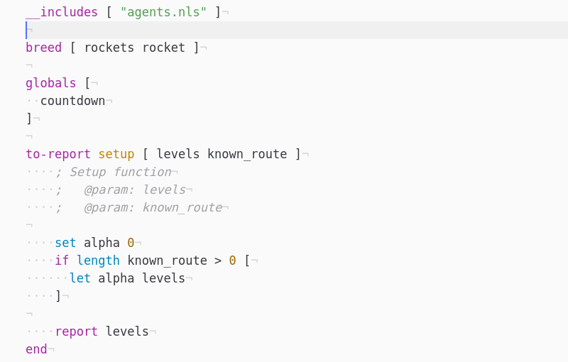

# language-netlogo

An Atom package that provides basic syntax highlighting for [NetLogo](https://ccl.northwestern.edu/netlogo/) files. The expected file extension is `.nlogo` or `.nls`.

### Current Functionality

 - Syntax highlighting for Comments, functions, (subset of) built-in functions, keywords
 - Recognizing function blocks
